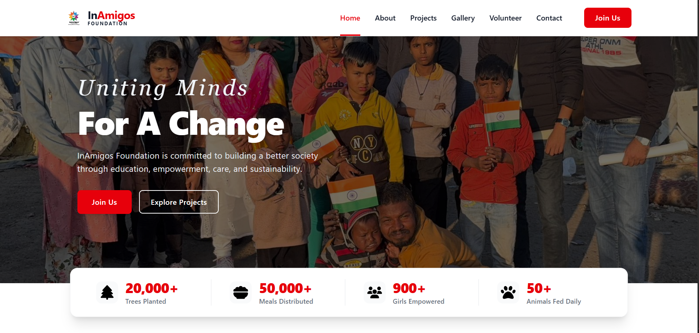
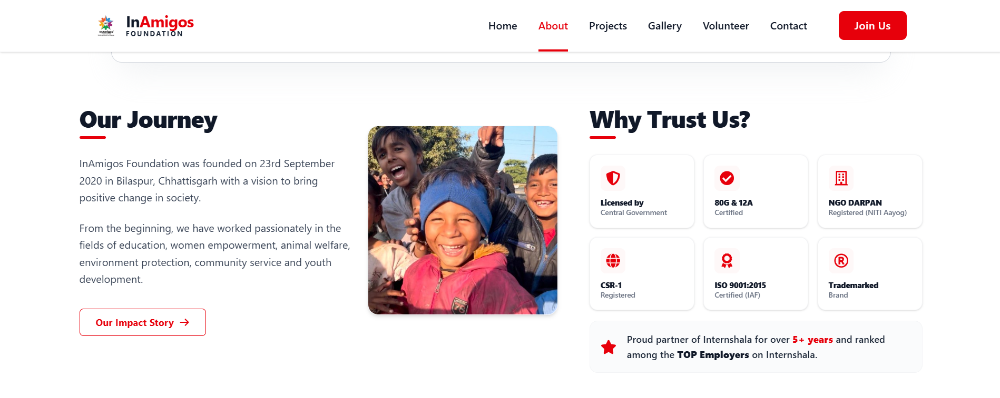
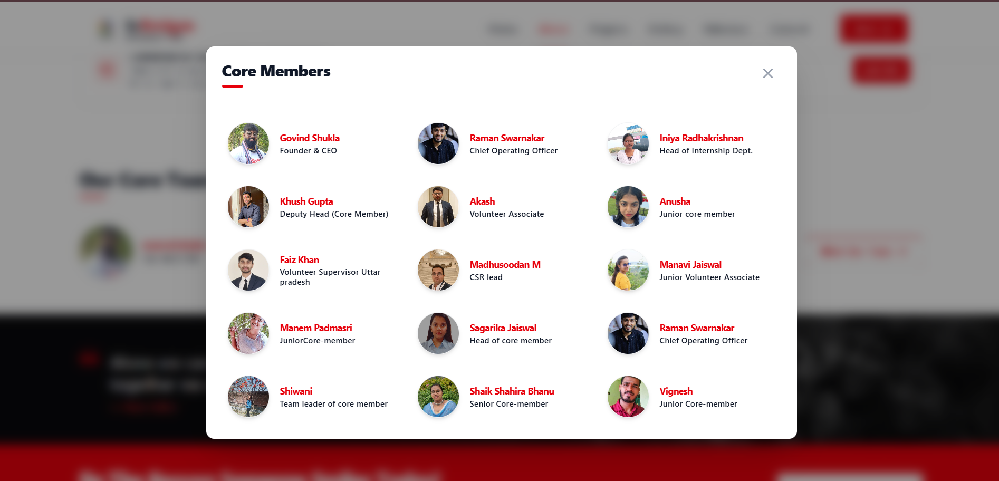
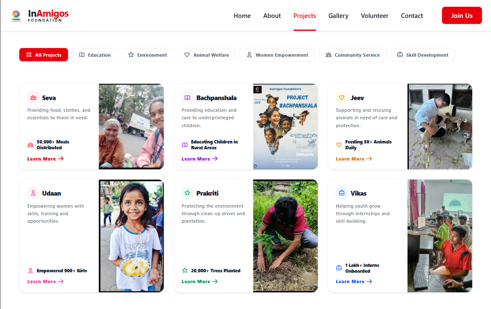
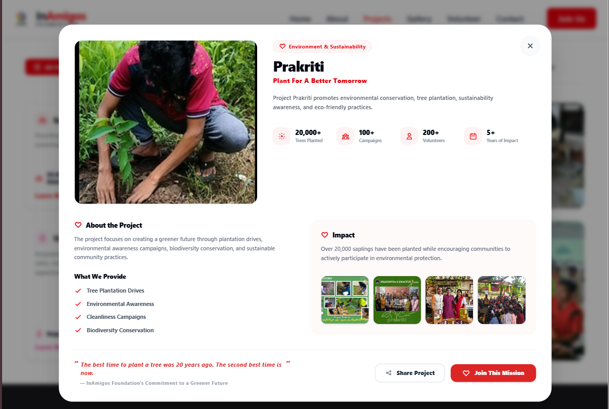
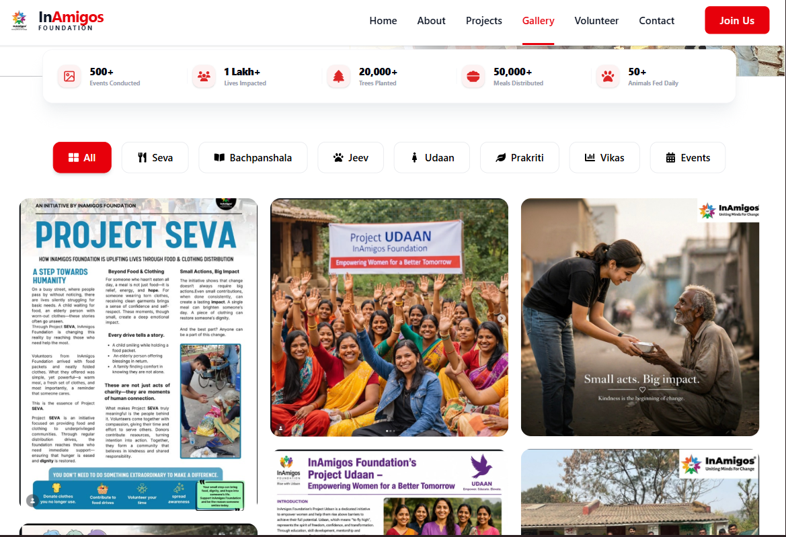
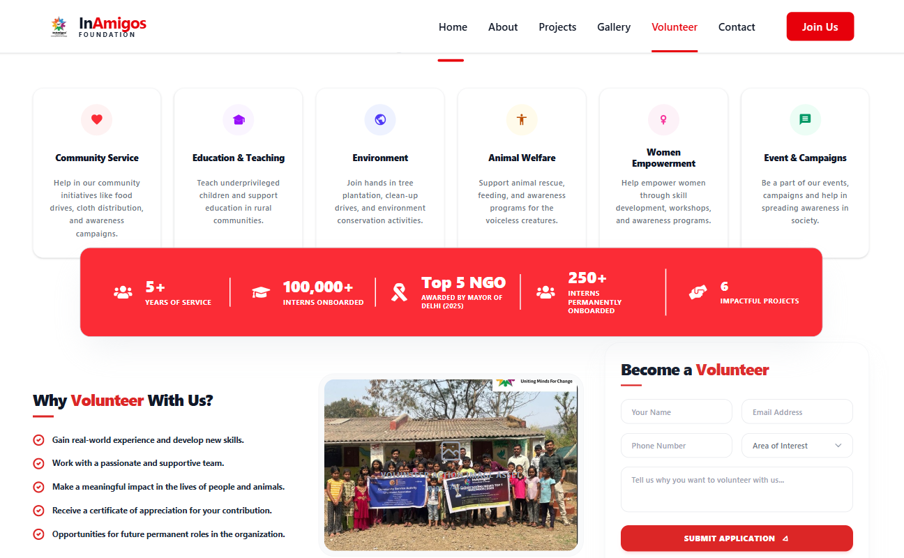
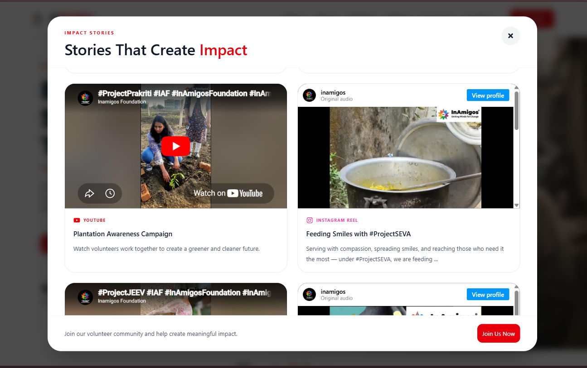
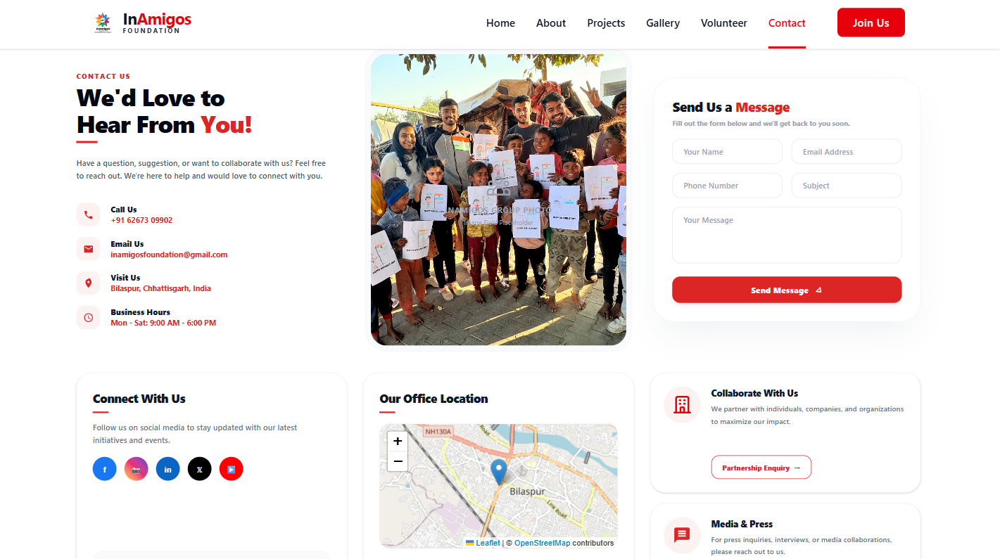
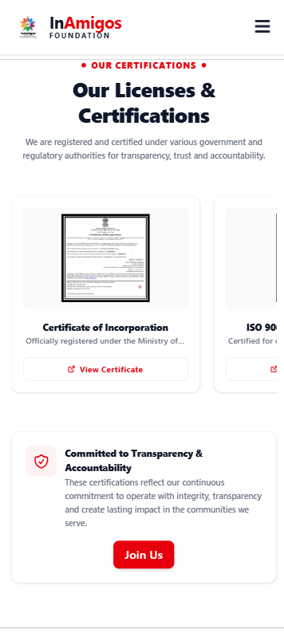

# 🌍 InAmigos Foundation Awareness App

### A Modern Digital Platform Showcasing Social Impact & Community Initiatives

[](https://react.dev/)
[](https://tailwindcss.com/)
[](https://vitejs.dev/)
[](https://vercel.com/)

> **InAmigos Foundation Awareness App** is a responsive web platform built to showcase the mission, initiatives, achievements, and community impact of InAmigos Foundation. The platform helps visitors explore NGO projects, volunteer opportunities, and real-world social impact through an engaging digital experience.

---

## 🔗 Live Demo

🌐 https://in-amigos-foundation-awareness-app.vercel.app/

---

## 🎯 Project Objective

The primary goal of this project is to strengthen the digital presence of InAmigos Foundation by:

* Promoting awareness of social initiatives.
* Highlighting project achievements and community impact.
* Encouraging volunteer participation.
* Showcasing transparency and organizational credibility.
* Creating an engaging and accessible experience for visitors.

---

## 📸 Project Showcase

|                     Home Page                    |                    About Us                   |
| :----------------------------------------------: | :-------------------------------------------: |
|      |  |
| **Landing Experience & Foundation Introduction** |      **Mission, Vision & Certifications**     |

|                     Core Team                     |                     Projects                     |
| :-----------------------------------------------: | :----------------------------------------------: |
|  |  |
|         **Leadership & Volunteer Network**        |          **Explore All NGO Initiatives**         |

|                 Project Details Modal                 |                     Gallery                     |
| :---------------------------------------------------: | :---------------------------------------------: |
|  |  |
|          **Detailed Initiative Information**          |         **Campaigns & Event Highlights**        |

|                   Volunteer Page                  |                  Impact Videos                 |
| :-----------------------------------------------: | :--------------------------------------------: |
|  |  |
|      **Volunteer Registration & Information**     |       **Stories & Social Impact Videos**       |

|                   Contact Page                  |               Mobile Responsive Design              |
| :---------------------------------------------: | :-------------------------------------------------: |
|  |  |
|         **Reach Out To The Foundation**         |           **Optimized Across All Devices**          |

---

## ✨ Core Features

### 🌟 NGO Awareness Platform

* Modern and responsive user experience.
* Dedicated pages for NGO activities and achievements.
* Easy navigation and accessibility.

### 🤝 Volunteer Engagement

* Volunteer information portal.
* Awareness-driven participation system.
* Community engagement focused design.

### 📷 Interactive Media Experience

* Dynamic image galleries.
* Project showcase cards.
* Impact story video modal.

### 👥 Team & Organizational Transparency

* Core team showcase.
* NGO certifications display.
* Detailed project information panels.

### 📈 SEO & Visibility

* Meta tags optimization.
* Open Graph integration.
* Google Search Console verification.
* Sitemap & robots.txt support.

---

## 🏗️ Project Architecture

| Layer    | Technology                      |
| -------- | ------------------------------- |
| Frontend | React.js                        |
| Styling  | Tailwind CSS                    |
| Routing  | React Router                    |
| Icons    | React Icons                     |
| Bundler  | Vite                            |
| Hosting  | Vercel                          |
| SEO      | Sitemap, Robots.txt, Open Graph |

---

## 🛠️ Tech Stack

### Frontend


### Deployment & SEO


---

## 🚀 Getting Started

### Clone Repository

```bash
git clone https://github.com/grathan-P/InAmigos_Foundation_Awareness_app.git

cd InAmigos_Foundation_Awareness_app
```

### Install Dependencies

```bash
npm install
```

### Run Development Server

```bash
npm run dev
```

### Production Build

```bash
npm run build
```

---

## 🔍 SEO Configuration

* Google Search Console Verified
* XML Sitemap Implemented
* Robots.txt Configured
* Open Graph Meta Tags
* Search Engine Friendly Structure
* Social Sharing Optimization

---

## 🔮 Future Improvements

* [ ] Multi-language Support
* [ ] Donation Integration
* [ ] Dynamic Project Management Dashboard
* [ ] Blog & Success Stories Section
* [ ] Volunteer Registration Backend
* [ ] Event Management System

---

## 👨‍💻 Developer

**Grathan P Bangera**

* LinkedIn: [Grathan P Bangera](https://www.linkedin.com/in/grathan-p-bangera-6b5306339)
* GitHub: [grathan-P](https://github.com/grathan-P)

---

### 📄 License

This project was developed for educational and awareness purposes in support of InAmigos Foundation.
